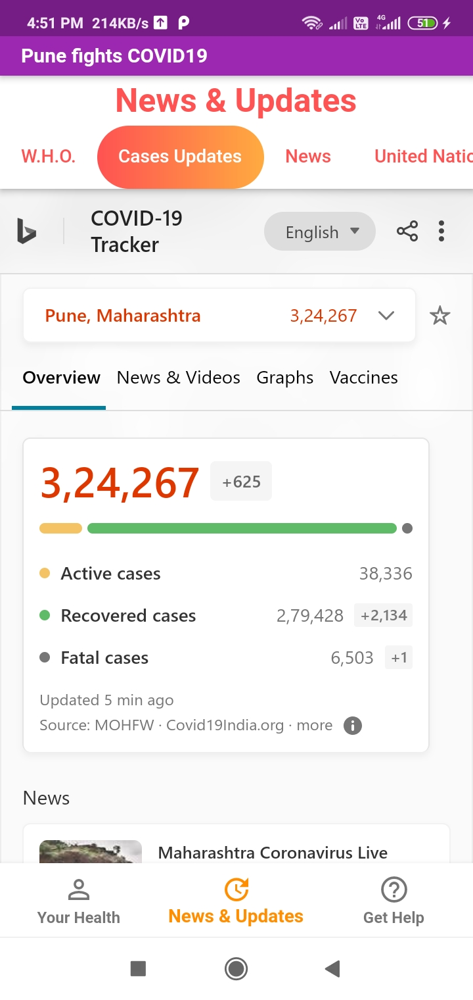
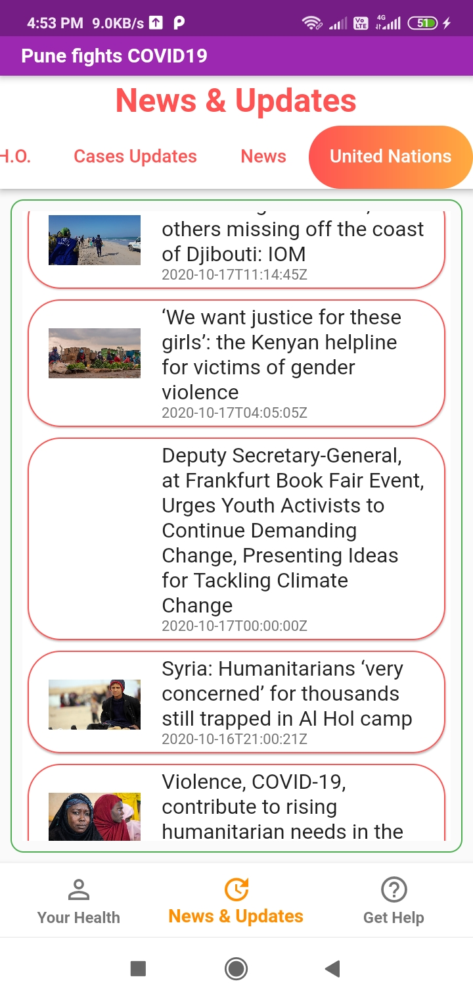

# pune_fights_covid19

Flutter android app that gives real time covid19 cases, news, updates from WHO & UN, info about covid19 disease and helpline info for Pune City in India.

### Some Screenshots from app

<p align="center">
  
  
  
</p>

### Dependencies Used

```
dependencies:
  flutter:
    sdk: flutter
  cupertino_icons: ^0.1.2
  fluttericon: ^1.0.7
  url_launcher: ^5.4.0 
  easy_web_view: ^1.3.0
  http: ^0.12.0
  
```

### Folder Structure
Here is the core folder structure which flutter provides.

```
flutter-app/
|- android
|- assets 
|- build
|- ios
|- keys
|- lib
|- test
|- web
```

Here is the folder structure we have been using in this project

```
lib/
|- News/
|- Your Health/
|- home_page.dart
|- main.dart
|- splash_screen.dart
|- TAB1_your_health.dart
|- TAB2_news.dart
|- TAB3_get_help.dart
```

Now, lets dive into the lib folder which has the main code for the application.

```
1- main.dart - This is the starting point of the application. Our app will start from here. Code in this file will throw flash screen on our app for 2 seconds and then it will lead us to home_page.dart
2- home_page.dart - This program will show us home page of our app which will have three main tabs, i.e. "Your Health", "News", "Get Help".
3- splash_screen.dart - This program will have animated icon that will play on user's screen before our app gets started.
4- Your Health/ - This folder will have all the tabs for our homepage's Your Health tab
5- News/- This folder will have all the tabs for our homepage's News tab.

```


## Info to get started with flutter 

This project is a starting point for a Flutter application.

A few resources to get you started if this is your first Flutter project:

- [Lab: Write your first Flutter app](https://flutter.dev/docs/get-started/codelab)
- [Cookbook: Useful Flutter samples](https://flutter.dev/docs/cookbook)

For help getting started with Flutter, view our
[online documentation](https://flutter.dev/docs), which offers tutorials,
samples, guidance on mobile development, and a full API reference.
