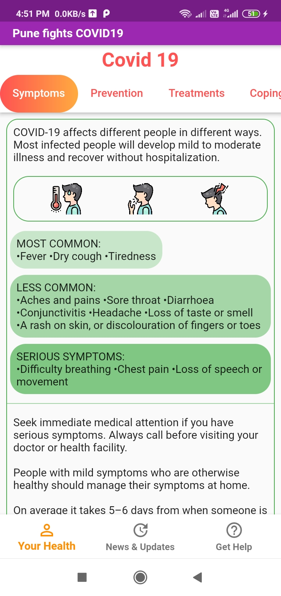
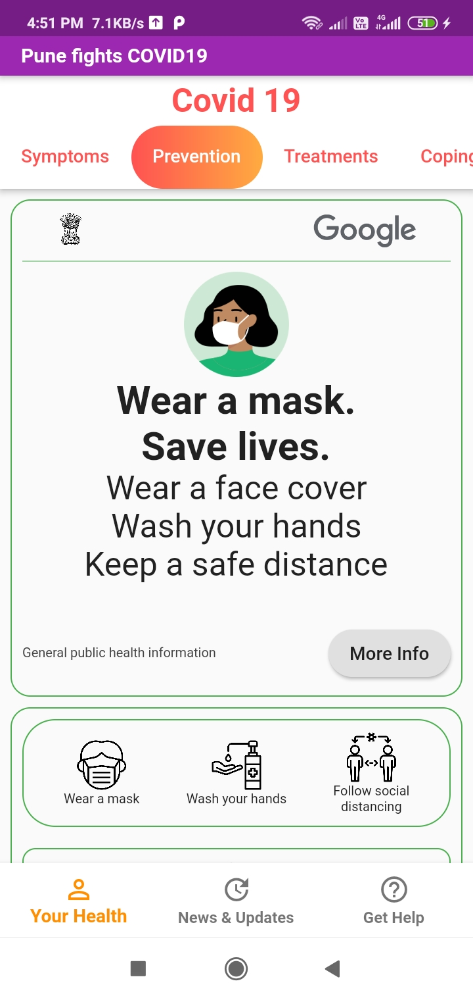

# pune_fights_covid19

Flutter android app that gives real time covid19 cases, news, updates from WHO & UN, info about covid19 disease and helpline info for Pune City in India.

  
  
  

https://github.com/vaibhavkdd/real_time_covid19_flutter_app/blob/main/screenshots/Screenshot_2020-10-20-16-51-21-398_com.example.pune_fights_covid19%20(1).jpg

## Info to get started with flutter 

This project is a starting point for a Flutter application.

A few resources to get you started if this is your first Flutter project:

- [Lab: Write your first Flutter app](https://flutter.dev/docs/get-started/codelab)
- [Cookbook: Useful Flutter samples](https://flutter.dev/docs/cookbook)

For help getting started with Flutter, view our
[online documentation](https://flutter.dev/docs), which offers tutorials,
samples, guidance on mobile development, and a full API reference.
